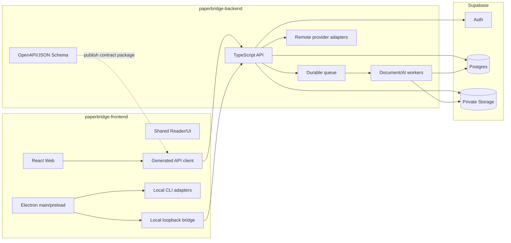
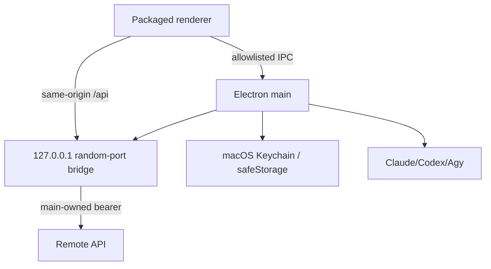

# 02. 목표 아키텍처

## 원칙

1. 두 저장소, 하나의 계약
2. 마이크로서비스가 아닌 modular monolith 우선
3. 장기 작업은 queue/worker
4. renderer/PDF/provider 응답은 비신뢰
5. 모든 AI 결과는 근거 상태를 가짐
6. PDF 좌표·parser version을 계약화
7. parse 전 Reader 즉시 진입
8. 예산은 실행 전에 강제

## 전체 구조



## Frontend 책임

- React/Vite UI와 PDF Reader
- generated client와 MSW mock
- Web cookie session UX
- Electron main/preload/local bridge
- local CLI adapters
- macOS package/sign/notarize/update

금지: service key, remote provider secret, direct DB, arbitrary IPC/shell/proxy.

## Backend 책임

- OpenAPI/JSON Schema 원본과 contract package publish
- Auth/workspace/RBAC
- Postgres migration/RLS
- private Storage
- document parse/index worker
- remote AI gateway/BYOK encryption
- run/budget/usage/audit

금지: React/Electron UI, provider SDK 타입 공개, migration 없는 DB 변경.

## Backend process

```text
apps/api      # 짧은 HTTP, auth, metadata, SSE
apps/worker   # parse/index/cleanup
packages/domain, contracts, db, storage, providers, observability
```

동일 repo·domain을 공유하되 API와 worker는 별도 배포/scale한다.

## Web topology

- static SPA: `app.<domain>`
- API: `api.<domain>`
- exact CORS allowlist, credentialed cookie
- frontend는 service role을 모름

## Desktop topology



### local bridge

- `127.0.0.1:0`만 bind
- static assets + allowlisted API path/method proxy
- main-owned token 주입
- arbitrary target URL 금지
- header/body/output/timeout 제한
- Origin/Host/nonce 검증

### Desktop auth

- system browser + Authorization Code + PKCE S256
- loopback callback
- main process가 code 교환
- refresh token은 safeStorage로 암호화
- server device session 개별 revoke

### Local AI

- executable path/credential을 renderer에 노출하지 않음
- fixed adapter와 `spawn(command,args)`
- PDF path가 아닌 정제 context만 전달
- app-owned read-only cwd
- common event schema로 normalization

## Document flow

1. upload session 생성
2. signed Storage upload
3. complete + checksum verification
4. document/version/job transaction
5. Reader는 원본 즉시 표시
6. worker parse→structure→index
7. page/block/object graph 준비
8. summary/chat/object action enable

## Run flow

1. `POST /v1/runs`
2. auth/capability/provider/budget/idempotency 검증
3. `202` + event URL
4. `GET /v1/runs/{id}/events` SSE
5. event append/replay/live tail
6. terminal + citation + usage settlement
7. `Last-Event-ID` reconnect

## Contract 배포

- backend owns `openapi.yaml`
- CI publishes `@paperbridge/api-contract`
- frontend pins exact version
- additive change minor, breaking major
- old minor compatibility window 유지
- Git submodule 대신 package/artifact 사용

## 확장 기준

worker/provider를 별도 서비스로 분리하는 것은 queue 지연, 장애 격리, 배포 빈도, 소유 팀, 데이터 저장소가 실제로 달라질 때만 검토한다.
