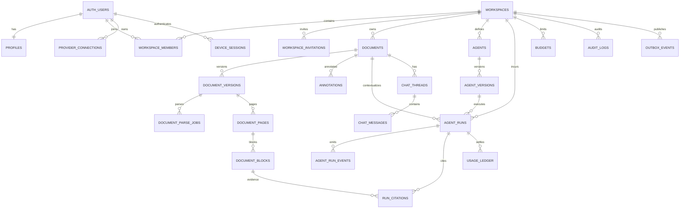
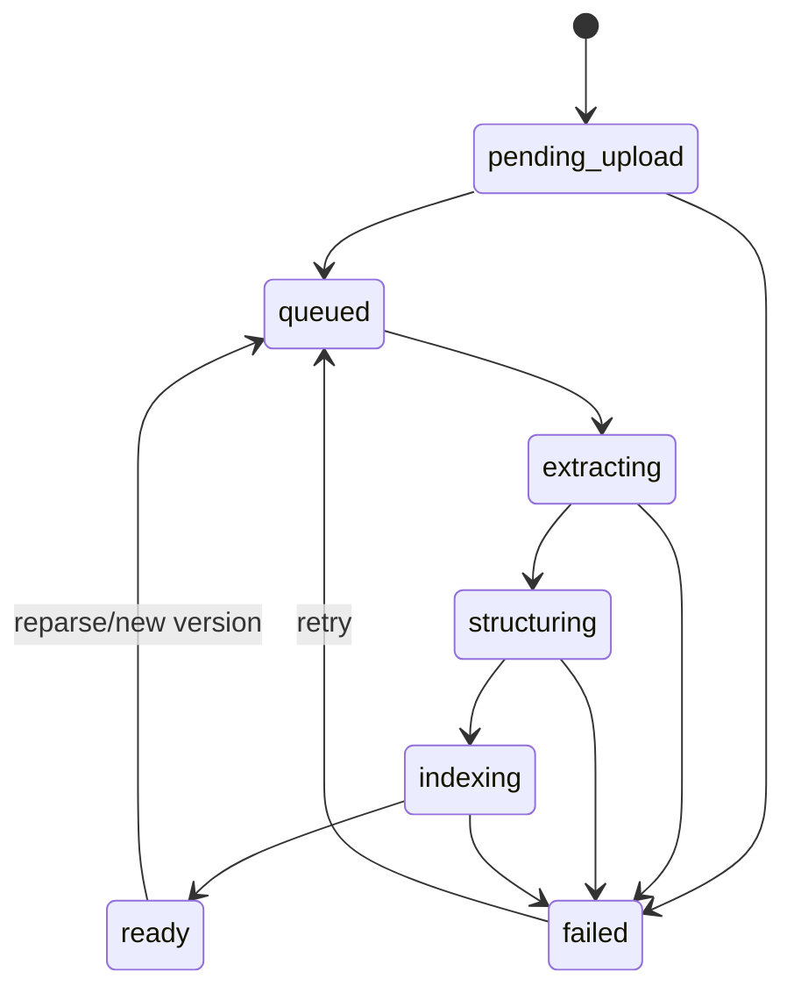
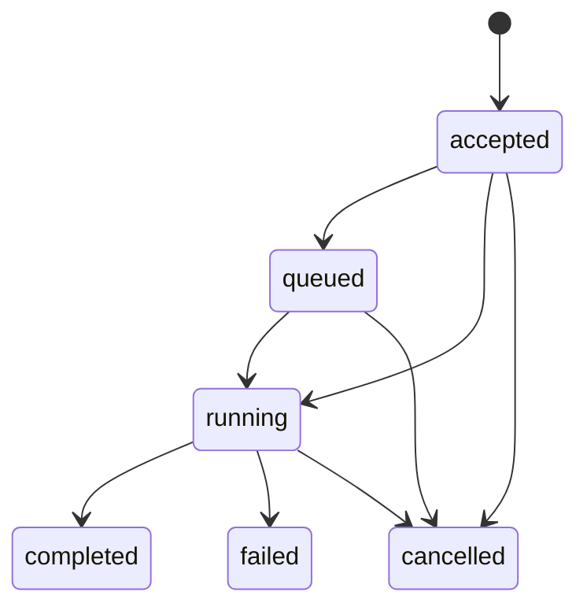

# 04. 도메인 모델과 ERD

## 목표

세션별 JSON aggregate를 workspace 권한, document version/parse, annotation, agent/run, chat, usage가 query 가능한 정규화 모델로 전환한다.

## ERD

## 주요 테이블

### 사용자/Workspace

- `profiles`: display name, locale, timezone
- `workspaces`: personal/lab, owner, plan, status
- `workspace_members`: owner/admin/member/viewer
- `workspace_invitations`: token hash, role, expiry

모든 사용자 자원은 workspace가 권한 루트다. 개인 사용자도 personal workspace 하나를 갖는다.

### Document

- `documents`: 논리 문서, title/source/parse_state/current_version
- `document_versions`: Storage path, size, SHA-256, parser/object graph version
- `document_parse_jobs`: queue status/attempt/lease/error
- `document_pages`: geometry/rotation/text/block count
- `document_blocks`: role/order/text/normalized bounds/search vector

원본 전체 Object Graph는 private Storage artifact로 두고, DB에는 page/block query projection을 둔다.

### Annotation

`annotations` 하나로 highlight/note/explanation/translation pin을 표현한다.

- document/version/page
- `anchor jsonb` validated by SelectionAnchor schema
- selected text snapshot
- body/color token/source run
- orphan relocation state

### Agent/Provider/Run

- `agents`: identity, scope, visibility
- `agent_versions`: immutable prompt/retrieval/model/budget policy
- `provider_connections`: encrypted secret + public status
- `agent_runs`: request snapshot, provider/model, state, budget/usage/result
- `agent_run_events`: append-only replay stream
- `run_citations`: page/block/anchor evidence

### Chat/Usage/Operations

- `chat_threads`, `chat_messages`
- `budgets`, `usage_ledger`
- `device_sessions`
- `idempotency_keys`
- `audit_logs`
- `outbox_events`

## 상태 머신

### Document

### Run

terminal 상태는 정확히 하나이며 CAS/transaction으로 전이한다.

## JSONB 경계

허용:

- anchor/bounds
- versioned provider-independent config snapshot
- append-only event payload

금지:

- permission relation
- resource foreign key
- parse/run state
- 비용/토큰 집계 핵심 field
- 자주 filter/sort하는 속성

## 인덱스

- `workspace_members(user_id, workspace_id)`
- `documents(workspace_id, updated_at desc, id desc) where deleted_at is null`
- `document_blocks(version_id, page_number, reading_order)` + text GIN
- `annotations(document_id, page_number, created_at)`
- `agent_runs(workspace_id, created_at desc)` + active partial
- `agent_run_events(run_id, sequence)` PK
- `usage_ledger(workspace_id, occurred_at)`

## 보존

| 데이터 | 기본 제안 |
|---|---|
| soft-deleted document | 30일 후 Storage/artifact 삭제 |
| run events | 30일; final projection 장기 |
| provider secret | 연결 삭제 즉시 ciphertext 삭제 |
| idempotency | 24시간 |
| expired upload | 24시간 내 cleanup |
| audit | 180일 목표, 법무 검토 후 확정 |

구현 SQL은 `database/001_core_schema.sql`, `002_rls_policies.sql`, `003_seed_agents.sql`에 있다.
