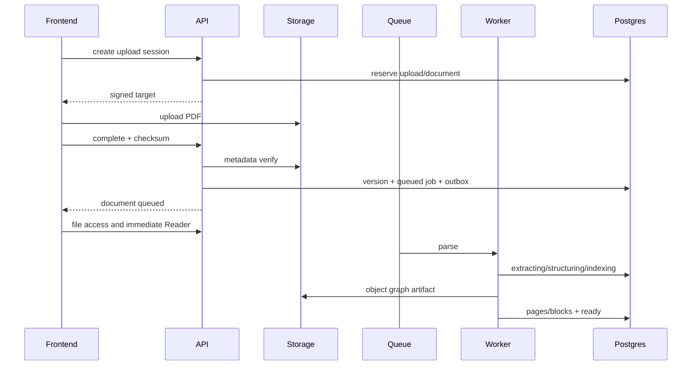

# 07. 문서 파이프라인

## 목표

- upload 후 parse를 기다리지 않고 읽기
- 0..1 normalized 좌표와 multi-rect selection
- renderer/parser contract parity
- 2단/회전/여러 줄 selection
- summary/chat의 block citation
- 실패 분류·재시도

## Upload lifecycle



## Server-side validation

- declared MIME
- `%PDF-` magic
- `0 < size <= limit`
- Storage metadata/complete request 일치
- SHA-256
- page count > 0
- password/corruption 구분
- parser resource/time limit
- filename은 display metadata, path는 UUID

## Storage layout

```text
paperbridge-documents/private
workspaces/{workspaceId}/documents/{documentId}/versions/{versionId}/source.pdf
.../object-graph-v1.json.zst
.../pages/{page}.webp  # optional
```

## Parse stages

### Extracting

- page geometry/rotation
- PDF text items/transform/font
- textless page detection

### Structuring

- same-line item merge
- multi-column reading order
- line→block grouping
- heading/paragraph/caption/list/table/equation candidate
- object-caption relation

### Indexing

- stable block ID
- full-text index
- section ancestry
- optional embedding

## Object Graph

`contracts/pdf-object-graph.schema.json`이 권위다.

- `schema_version`
- page 1-based
- top-left normalized bounds
- deterministic page/item/line/block IDs
- reading_order
- extensible role with frontend unknown fallback
- parser/object graph version metadata

## SelectionAnchor

- page number
- 1~128 normalized rects
- optional text range item IDs/offsets
- selected text snapshot
- single-page MVP
- finite values, bounds, length validation

## Parser parity

- FE/BE의 `pdfjs-dist` compatibility fixture
- parser name/version/object graph version 저장
- geometry/text order/bounds tolerance test
- mismatch 시 server block overlay fail-safe disable, local selection 유지

## 빠른 진입

Upload 완료 즉시 원본 file로 canvas/TextLayer를 표시한다. Selection explain/translate는 local surrounding context로 허용한다. Summary/chat/object explanation은 server graph ready 후 활성화한다.

## Retrieval 기본

| 작업 | context |
|---|---|
| selection explain | selection block + 앞뒤 block + heading |
| selection translate | selection + 최소 문장 context |
| equation | equation + 주변 paragraph + symbol context |
| figure/table | object/caption + 참조 paragraph |
| page translate | page reading order |
| summary | section representative blocks |
| chat | query rewrite + full-text/embedding top-k + diversity |

전체 PDF를 매 요청마다 provider에 보내지 않는다.

## 근거

- prompt에 stable block IDs
- output citation allowlist
- 근거 없으면 명시
- UI citation click → page/anchor
- quoted snapshot은 짧게 저장

## 실패/재시도

| code | retry |
|---|---|
| password/corrupt/too_large | no |
| storage_download_failed | yes |
| parser_resource_limit | conditional |
| object_graph_write_failed | yes |
| indexing_failed | yes |
| unsupported_feature | Reader-only fallback |

attempt, lease, heartbeat, exponential backoff+jitter, dead letter, idempotent artifact path를 사용한다.

## OCR

textless page를 candidate로 표시하고 P1/P2에서 explicit/plan-based OCR을 실행한다. OCR provenance를 원본 text와 분리하고 동일 normalized coordinate contract로 변환한다.

## Fixture

1단, 2단, 회전, 수식, 표/그림, scanned, password, corrupt, 50MiB 경계, multi-rect, 한영 혼합, 300-page 문서를 포함한다.
