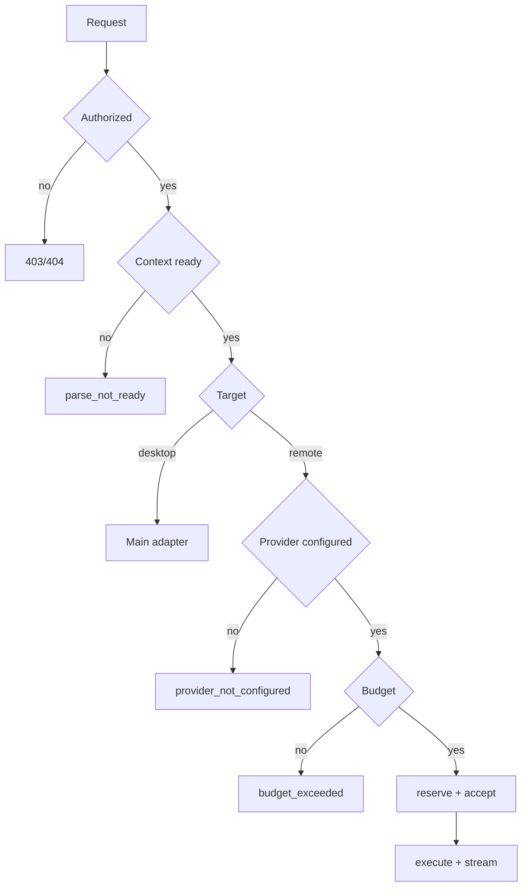

# 08. Agent/Provider 실행 명세

## 목표

OpenRouter와 desktop CLI를 같은 UI 계약으로 다루고 provider 차이를 adapter 안에 격리한다. 실행 전에 권한·context·provider·budget을 확정하고, stream reconnect/cancel/timeout/citation/usage를 지원한다.

## 개념

- **Provider**: OpenRouter, Claude Code, Codex, Agy
- **Model**: provider의 구체 모델/capability/pricing
- **Agent**: versioned instruction/retrieval/model/budget template
- **Run**: 특정 agent version + context + provider/model 실행 instance

## Canonical request

```ts
interface AgentRunRequest {
  workspaceId: string
  documentId: string
  agentId?: string
  operation: 'explain-selection'|'translate-selection'|'translate-page'|'summarize-document'|'document-chat'|'explain-figure'|'explain-table'|'explain-equation'
  scope: 'selection'|'page'|'section'|'document'
  selection?: SelectionAnchor
  pageNumber?: number
  userPrompt?: string
  executionPreference: 'auto'|'remote'|'desktop-local'
  providerId?: string
  modelId?: string
  maxCostMicrousd?: number
}
```

Desktop-local 실행은 frontend main adapter가 담당하고, 선택적으로 metadata/result만 server sync한다.

## Agent version

immutable:

- system/task instruction
- supported operations/context shape
- retrieval/citation policy
- output format
- model selector
- context/output limits
- budget/safety policy version

## Run decision



## Budget

- model price snapshot + input estimate로 conservative reservation
- request cap, agent cap, remaining budget의 최소값
- provider 호출 전에 reservation
- completion 시 actual debit + release
- usage 미제공 시 estimated flag
- output cap 도달 시 abort
- concurrent overspend는 DB lock/transaction으로 차단

## Remote adapter

```ts
interface RemoteProviderAdapter {
  id: string
  testConnection(input: TestInput): Promise<TestResult>
  listModels?(signal: AbortSignal): Promise<ModelDescriptor[]>
  run(input: ProviderRunInput): AsyncIterable<ProviderEvent>
}
```

책임: protocol translation, auth, timeout, SSE/JSONL parse, error/usage normalization. 권한·budget·DB transaction·UI 문구는 담당하지 않는다.

## Desktop adapter

- executable 탐지는 main 내부
- absolute path 비공개
- health는 public status만
- prompt/options/time/output 검증
- shell interpolation 금지
- app-owned read-only cwd
- process tree cancel
- stderr/raw path/secret redaction
- window/global concurrency limit

## Prompt assembly

1. trusted system safety
2. agent instruction
3. task/output contract
4. untrusted document blocks with IDs
5. selection metadata
6. user question

문서 속 명령은 분석 대상 데이터로만 취급한다.

## Canonical events

Envelope: schema version, event ID, run ID, sequence, type, timestamp, provider/model, payload.

- `run.accepted`
- `run.started`
- `run.delta`
- `run.citation`
- `run.warning`
- `run.result`
- `run.failed`
- `run.cancelled`
- `run.completed`

`failed/cancelled/completed` terminal은 정확히 하나다.

## Cancel/retry

- disconnect는 cancel이 아님
- provider abort best effort
- terminal race는 CAS
- cancel 후 late event drop
- stream 시작 후 provider auto retry는 기본 금지
- user retry는 새 run + `retry_of_run_id`

## Citation

- explain/summary/chat은 citation required
- translation은 source selection 자체가 citation
- context allowlist 밖 ID 제거
- 근거 없으면 `unsupported_by_document`
- UI 근거와 실제 provider context 일치

## Secret

- BYOK는 backend envelope encryption + key version
- decrypt scope 최소화
- key response/log 금지
- desktop CLI credential은 PaperBridge가 읽지 않음

## 테스트

malformed stream, duplicate terminal, timeout/cancel race, output limit, error redaction, budget concurrency, citation allowlist, prompt injection corpus, desktop path/symlink/options, reconnect replay.
