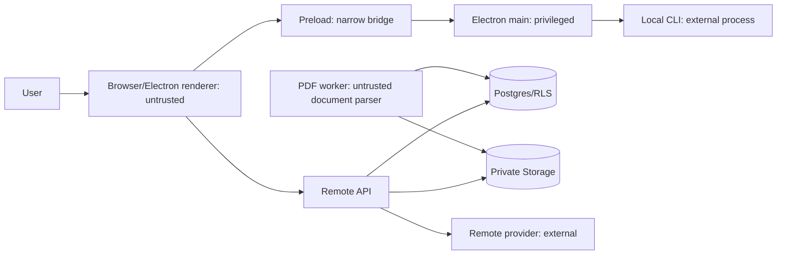

# 14. 보안·개인정보 명세

## 보호 대상

- 인증 cookie, refresh/device token
- BYOK API key와 encryption key
- 비공개 PDF·파싱 artifact·선택 문장·메모
- 사용자 질문·AI 답변·citation
- workspace membership·사용량·결제
- Desktop local CLI의 실행 환경·경로·credential

## 신뢰 경계

Renderer, PDF, provider output, local CLI output, webhook payload는 모두 비신뢰 입력이다.

## Web/API

- production cookie: `Secure`, `HttpOnly`, 적절한 `SameSite`, 짧은 access와 rotation되는 refresh/session.
- credentialed CORS는 정확한 origin allowlist만 사용한다.
- state-changing 요청은 Origin/Host 검증 및 cookie 전략에 맞는 CSRF token을 적용한다.
- request/response를 OpenAPI runtime schema로 검증하고 unknown write field를 거부한다.
- multipart, JSON, prompt, rect, output에 명시적 limit를 둔다.
- auth·upload·run·provider-test에 user/IP/workspace 차원의 분산 rate limit을 둔다.
- 권한 없는 resource 존재 여부가 노출되지 않도록 404/403 정책을 일관되게 사용한다.

## Supabase/Postgres/RLS

- 모든 사용자 table은 workspace/user ownership을 명시한다.
- browser가 DB service role을 받지 않는다.
- API request role과 worker service role을 분리한다.
- RLS policy는 helper function의 `search_path`를 고정하고 `security definer`를 최소화한다.
- migration PR은 cross-tenant negative test를 포함한다.
- raw SQL query와 Storage path에 사용자 제공 문자열을 연결하지 않는다.

## Private Storage

- bucket은 public이 아니다.
- object path는 UUID 기반이고 표시 filename과 분리한다.
- signed URL은 짧고 single-purpose이며 log/referrer에 남기지 않는다.
- upload complete에서 size/MIME/magic/checksum/ownership을 다시 검증한다.
- 삭제는 DB soft-delete 뒤 비동기 object/artifact purge와 reconciliation으로 처리한다.

## PDF parser 격리

- PDF는 공격자 제어 binary로 취급한다.
- worker는 non-root, read-only filesystem, 제한된 temp, CPU/memory/time/page/size limit를 사용한다.
- 가능하면 outbound network를 차단한다.
- parser dependency patch를 주기적으로 추적한다.
- filename, embedded URL, JS/action, attachment를 자동 실행하지 않는다.
- worker crash가 API process나 다른 job의 secret에 접근하지 못하게 한다.

## BYOK

- API key는 TLS 이후 backend에서만 수신한다.
- envelope encryption: data key로 AES-GCM ciphertext 생성, key-encryption key version을 별도 관리한다.
- AAD에 owner/provider/connection ID를 포함해 ciphertext swapping을 방지한다.
- decrypt는 provider 호출 직전에 최소 scope로 하고 즉시 참조를 폐기한다.
- response/log/analytics/support export에 secret 또는 prefix를 과도하게 노출하지 않는다.
- 연결 삭제 시 ciphertext 삭제, key rotation job, audit event를 남긴다.
- 조직 공용 key와 개인 key의 선택 정책을 server에서 결정한다.

## AI·Prompt injection

- 문서와 사용자 content를 명령이 아닌 untrusted data boundary로 구분한다.
- system 정책, agent instruction, task contract, document block을 구조적으로 분리한다.
- provider tool/function은 default none; 임의 URL fetch, shell, file access를 허용하지 않는다.
- citation-required 작업은 전달한 block ID allowlist만 인정한다.
- 문서에서 확인되지 않는 답변은 명시 상태로 반환한다.
- prompt/output 원문을 기본 observability에 저장하지 않는다.

## Electron

- `contextIsolation: true`, sandbox 활성화, `nodeIntegration: false`.
- preload는 versioned typed method만 노출한다. generic `send/invoke`, raw token, file API, shell API, arbitrary URL proxy는 금지한다.
- IPC는 sender frame/origin/window와 argument schema를 검증한다.
- navigation/new-window를 차단하고 외부 링크는 HTTPS allowlist 뒤 system browser로 연다.
- loopback server는 `127.0.0.1:0`, random nonce, Host/Origin 검증, route/method/body limit을 사용한다.
- refresh token은 main에서 `safeStorage`로 암호화하고 renderer에 전달하지 않는다.
- package signing, hardened runtime, notarization, fuse 설정을 release gate로 둔다.

## Local CLI

- allowlisted executable과 고정 argument builder만 사용하며 shell interpolation을 금지한다.
- executable path, 홈 경로, credential 내용을 renderer에 노출하지 않는다.
- symlink/path substitution을 검증하고 app-owned 최소 권한 cwd를 사용한다.
- PDF 원본 path를 넘기지 않고 필요한 정제 context만 stdin으로 전달한다.
- process group 전체 cancel, timeout, output byte limit을 적용한다.
- stdout/stderr를 event schema로 검증하고 ANSI/path/secret을 redaction한다.

## Desktop 인증

- system browser Authorization Code + PKCE S256.
- state/nonce와 loopback redirect의 one-time code/짧은 expiry.
- main process가 code를 교환하고 device-bound session을 저장한다.
- user가 웹에서 개별 device를 revoke할 수 있다.
- custom protocol만 의존하지 않고 loopback fallback과 callback hijack 방어를 테스트한다.

## 로그·분석

기본 금지:

- Authorization/cookie/token/API key
- PDF body, 선택 문장, prompt, AI 전체 output
- signed URL, local absolute path, CLI environment
- provider raw response/error body

허용 가능한 구조화 field:

- request/run/job ID
- provider/model의 공개 identifier
- error code, HTTP status, duration, byte/token count
- workspace/user는 irreversible pseudonymous ID 또는 접근 제한된 audit ID

Redaction unit test와 production log sampling review를 release마다 수행한다.

## 보존·삭제

| 데이터 | 기본 제안 |
|---|---|
| upload session | 24시간 |
| run event delta | 30일 또는 더 짧게; final result 정책 별도 |
| soft-deleted document | 30일 후 source/artifact purge |
| provider secret | 연결 삭제 즉시 |
| audit | 180일 목표, 법무·학교 정책 검토 |
| support diagnostic | opt-in, 14일 |

사용자 삭제는 DB row, Storage object, provider secret, device session, 캐시, search/embedding, backup expiry까지 상태를 추적한다.

## 위협 시나리오와 gate

| 위협 | 통제 | 필수 검증 |
|---|---|---|
| cross-tenant PDF 조회 | policy+RLS+signed URL | negative integration |
| BYOK 유출 | envelope encryption+redaction | log/backup/response scan |
| malicious PDF | parser sandbox/limits | corpus/fuzz/crash isolation |
| localhost hijack | nonce/Host/Origin/path allowlist | hostile local page test |
| arbitrary CLI command | fixed spawn/args/schema | injection/symlink tests |
| prompt injection | untrusted boundary/no tools/citation | adversarial corpus |
| budget bypass | reservation transaction | concurrent race test |
| update supply-chain | signed artifact/feed/SBOM | clean Mac update test |

## 사고 대응

1. secret/key suspected: affected key version/provider connection revoke, session invalidation, log access freeze.
2. tenant isolation suspected: API feature kill switch, signed URL TTL 축소, audit query, 사용자 통지 검토.
3. malicious update: feed 중단, 이전 signed version 안내, signing credential rotation.
4. provider outage: circuit open, local provider 안내, 비용 reservation release reconciliation.
5. 모든 사고는 request/run/device/key version 기준 timeline과 사후 개선 owner를 남긴다.
