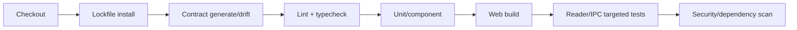
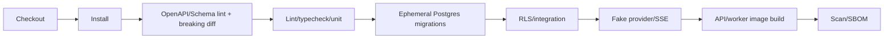
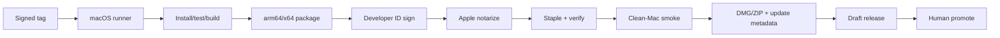

# 16. CI/CD 설계

## 원칙

- 두 저장소는 각각 clean clone으로 build/test/deploy 가능해야 한다.
- backend contract가 먼저 배포되고 frontend는 호환 범위 내 exact version을 pin한다.
- migration은 application deploy와 분리된 승인 단계다.
- Desktop signing/notarization credential은 fork/PR에서 접근할 수 없다.
- artifact는 commit SHA, contract version, build provenance, SBOM과 연결한다.

## Frontend PR pipeline

필수 job:

1. dependency cache는 lockfile key.
2. generated client drift check.
3. lint/typecheck/unit/component.
4. web production build와 bundle budget.
5. PDF fixture test.
6. Electron TypeScript/preload/IPC test.
7. MSW contract smoke.
8. dependency/license/SBOM.

merge 후 staging web deploy와 Playwright smoke를 실행한다.

## Backend PR pipeline

- base branch contract와 breaking diff.
- migration up + schema snapshot + policy test.
- test DB는 실제 extension/constraint를 사용한다.
- provider network 대신 deterministic fake server.
- container는 non-root와 healthcheck.
- service-role/env secret은 PR log에 노출하지 않는다.

## Contract release

1. backend PR에서 OpenAPI/JSON Schema 변경.
2. lint/example/conformance/breaking check.
3. merge 후 immutable `@paperbridge/api-contract` artifact publish.
4. changelog와 compatibility matrix 생성.
5. frontend bot/agent가 exact version bump PR.
6. staging consumer E2E 통과.
7. breaking major는 backend compatibility window와 migration guide 필수.

## Backend deploy

### Staging

- migration preview/rehearsal.
- migration one-shot 실행.
- API/worker image by digest deploy.
- health/readiness + synthetic flow.
- contract capability 확인.

### Production

- 승인된 release SHA/tag만.
- expand migration → backward-compatible API/worker → backfill → verification → contract migration 순서.
- canary/blue-green 가능하면 사용.
- error budget와 queue/provider dashboard 관찰.
- rollback은 image rollback과 forward-fix DB runbook을 분리한다.

## Frontend Web deploy

- API가 필요한 capability/contract를 제공하는지 preflight한다.
- content-hashed static artifact.
- CSP/headers 설정은 deploy config에서 검증한다.
- staging E2E 뒤 production promote.
- previous artifact 즉시 rollback 가능.

## macOS release pipeline

Secrets:

- signing certificate P12/base64와 password.
- App Store Connect API key 또는 notarization credential.
- update signing/feed credential.
- GitHub release token.

PR/fork에는 주입하지 않고 protected environment approval를 사용한다. artifact upload 전 `codesign`, `spctl`, notarization/staple 검증 결과를 보존한다.

## Branch protection

- direct push 금지(초기 docs bootstrap 제외 가능).
- required status checks와 최신 base 요구.
- CODEOWNERS review: contract, migration/RLS, Electron security, release workflow.
- signed commit/tag 정책은 팀 운영에 맞춰 적용.
- force push/branch delete 차단.
- merge queue 또는 squash 정책을 통일한다.

## Environment

| 환경 | 목적 | 데이터 |
|---|---|---|
| local | 빠른 개발 | fake/local Supabase, fake provider |
| preview | FE PR UI | MSW 또는 isolated staging API |
| staging | 통합/E2E/migration | synthetic/non-production |
| production | 사용자 | private live data |

staging과 production은 key, DB, Storage bucket, OAuth client, provider connection을 분리한다.

## Secret 관리

- repository secret보다 environment/organization secret 우선.
- 이름에 환경과 목적을 포함한다.
- workflow에서 secret echo/xtrace 금지.
- rotation owner/주기/마지막 검증일을 inventory로 관리한다.
- cloud/OIDC가 가능하면 장기 credential 대신 short-lived federation을 사용한다.

## Dependency·Supply chain

- lockfile immutable install.
- release artifact SBOM과 checksum.
- dependency update PR은 unit/contract/package test.
- critical/high vulnerability 정책과 예외 만료일.
- GitHub Actions는 가능하면 commit SHA pin.
- generated/downloaded binary의 checksum 검증.

## Release 버전

- backend API/contract: semantic version.
- web: app semantic version + commit SHA.
- desktop: semantic version; update channel `alpha`, `beta`, `stable`.
- DB migration은 monotonic timestamp/sequence.
- parser/object graph/schema version은 app version과 독립 기록.
