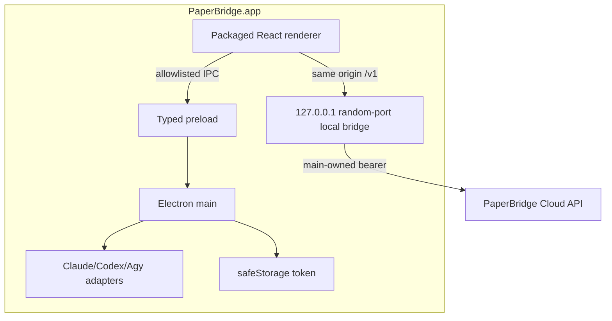

# 17. macOS Desktop 배포 계획

## 결정

**현재는 Electron을 유지한다.** 기존 저장소가 React/Vite와 Electron main/preload/local CLI 실행을 이미 갖고 있어, Tauri 전환은 MVP 기능·보안·배포를 동시에 다시 검증하게 만든다. Electron의 backend source import만 제거하고, Desktop을 frontend 저장소의 독립 배포 target으로 만든다.

## Electron vs Tauri

| 항목 | Electron | Tauri | 판단 |
|---|---|---|---|
| 기존 코드 재사용 | 매우 높음 | main/preload/IPC 재작성 | Electron |
| React UI 공유 | 직접 | 가능 | 동등 |
| local CLI/process | Node child_process 기존 자산 | Rust command/plugin 설계 | Electron |
| bundle/memory | 더 큼 | 작음 | Tauri 장점 |
| 팀 학습·출시 속도 | 낮은 추가 비용 | Rust/보안 모델 학습 | Electron |
| signing/notarization | 성숙한 Forge 생태 | 가능하나 새 pipeline | Electron |
| 장기 검토 | 안정화 후 성능 데이터로 | P2 ADR 재검토 | 보류 |

Tauri 재평가는 Desktop bundle/memory가 실제 구매·사용성 지표를 방해하고, 팀이 Rust 운영 역량을 확보했을 때 별도 spike로 한다.

## 목표 구조

Electron이 backend repo의 `server/app.ts`를 import하거나 cloud API를 package 안에서 재호스팅하지 않는다.

## Distribution 선택

### 1차: Developer ID, 웹사이트/GitHub Release 배포

- Mac App Store보다 빠르게 local CLI와 update 정책을 검증할 수 있다.
- Developer ID Application 인증서로 서명한다.
- hardened runtime과 필요한 최소 entitlement.
- Apple notarization 후 ticket을 staple한다.
- DMG는 사용자 설치, ZIP은 auto-update artifact/대체 배포에 사용한다.

### Architecture

초기에는 `arm64`와 `x64`를 별도 build하는 것을 기본으로 한다. 장점은 실패 격리와 artifact 크기·native dependency 문제 분석이다. 사용자가 한 파일을 요구하거나 update feed 운영이 복잡해지면 Universal build를 검토한다. 둘 다 clean Intel/Apple Silicon smoke가 필요하다.

## Bundle ID·버전

- bundle ID 예: `com.paperbridge.desktop` — 실제 소유 domain 확정 후 고정.
- product name: `PaperBridge`.
- semantic app version과 monotonically increasing build number.
- beta/stable channel을 update feed와 release tag에서 분리.
- downgrade/rollback 데이터 호환 정책을 명시한다.

## Electron hardening

- context isolation, sandbox, node integration off.
- navigation/window/open handler 차단.
- external HTTPS allowlist.
- preload schema validation과 sender 검증.
- fuse: run-as-node/inspect/asar integrity 등 실제 Electron/Forge 버전에 맞춰 최소 권한 구성.
- ASAR는 secret 보호 수단이 아니며 secret을 bundle하지 않는다.
- source map은 public artifact와 분리하고 접근 제어한다.

## Entitlement

기본은 network client와 JIT 등 Electron에 필요한 최소 entitlement만 사용한다. CLI 실행, child process, update helper에 필요한 항목을 Forge/Electron 현재 버전과 실제 package에서 검증한다. 광범위한 file access, automation, microphone/camera는 필요 기능이 생기기 전 요청하지 않는다.

## Signing·Notarization 절차

1. Apple Developer Program/Team과 Developer ID Application certificate 준비.
2. CI keychain에 일시적으로 certificate import.
3. app/helper 전체 sign과 hardened runtime.
4. `codesign --verify --deep --strict --verbose=2`.
5. notarization 제출·완료 대기.
6. app/DMG ticket staple.
7. `spctl --assess --type execute --verbose`와 notarization log 보관.
8. clean Mac에서 quarantine attribute가 있는 다운로드 artifact로 launch.
9. CI 종료 시 temporary keychain 삭제.

## DMG/ZIP

- DMG: Applications shortcut, 명확한 app name/version, background는 선택.
- ZIP: app bundle을 보존하며 update server 요구 형식에 맞춘다.
- artifact 이름: `PaperBridge-{version}-mac-{arch}.{dmg|zip}`.
- SHA-256 checksum, size, build SHA, contract version, minimum macOS를 release note에 기록.

## Auto Update

- Electron 지원 updater/Forge maker와 호환되는 signed feed를 사용한다.
- 모든 update는 서명과 metadata 검증을 통과해야 한다.
- check/download/install 상태를 renderer에 최소 정보로 노출한다.
- background download 정책과 restart consent를 명시한다.
- staged rollout: internal → beta 10%/50%/100% → stable.
- crash/launch failure 상승 시 feed를 이전 버전으로 고정하거나 rollout 중단한다.
- DB/local settings migration은 backward/forward compatible하게 한다.

## Local CLI UX

- 설치 상태는 `available/configured/version` 같은 공개 status만 표시한다.
- PaperBridge가 CLI credential을 읽거나 복사하지 않는다.
- 사용자가 선택한 local provider와 cloud provider 차이를 명확히 표시한다.
- 실행 전 전달 context, 비용(로컬은 외부 구독/CLI 정책), privacy를 안내한다.
- CLI가 없거나 update가 필요하면 공식 설치 안내만 열고 임의 package manager command를 자동 실행하지 않는다.

## Desktop 로그인

- system browser에서 cloud 로그인.
- PKCE S256/state와 loopback callback.
- main이 one-time code 교환 후 token을 safeStorage로 암호화.
- renderer는 local bridge를 통해 같은-origin API만 호출한다.
- settings에서 device name/last seen/revoke를 제공한다.

## Release channel

| Channel | 대상 | 요구 |
|---|---|---|
| internal | 팀 | unsigned 가능하나 보안 test 필수 |
| alpha | 개발 파트너 | signed/notarized, 수동 update 가능 |
| beta | 학생 20~30명 | auto-update, crash/support channel |
| stable | 유료 사용자 | staged rollout, rollback, SLA/지원 |

## RC 체크리스트

- clean checkout reproducible build.
- arm64/x64 install/launch/logout/relaunch.
- Gatekeeper prompt가 개발자 확인 불가로 차단하지 않음.
- auth PKCE와 token restore/revoke.
- PDF upload/open/selection/explain/translate/highlight.
- OpenRouter remote + 각 지원 local CLI health/run/cancel.
- sleep/wake, network offline/reconnect.
- update from previous stable and rollback handling.
- path에 공백/한글, non-admin user, fresh home directory.
- uninstall 후 user data 보존/삭제 정책 안내.

## 일정

1. **M0** backend import 제거·production-like package.
2. **M1** unsigned internal arm64/x64 QA.
3. **M2** certificate/entitlement/sign/notarize.
4. **M3** DMG/ZIP + beta feed + diagnostic.
5. **M4** 20~30명 Closed Beta에서 install/update/CLI 사용 검증.
6. **M5** stable channel과 고객 지원·rollback 운영.

## App Store

Mac App Store는 local CLI 실행, sandbox entitlement, 결제 정책, updater 교체 비용을 별도 검토한 뒤 P2로 둔다. 웹 결제·구독과 Store 정책은 출시 직전 최신 약관/법률 검토가 필요하다.
